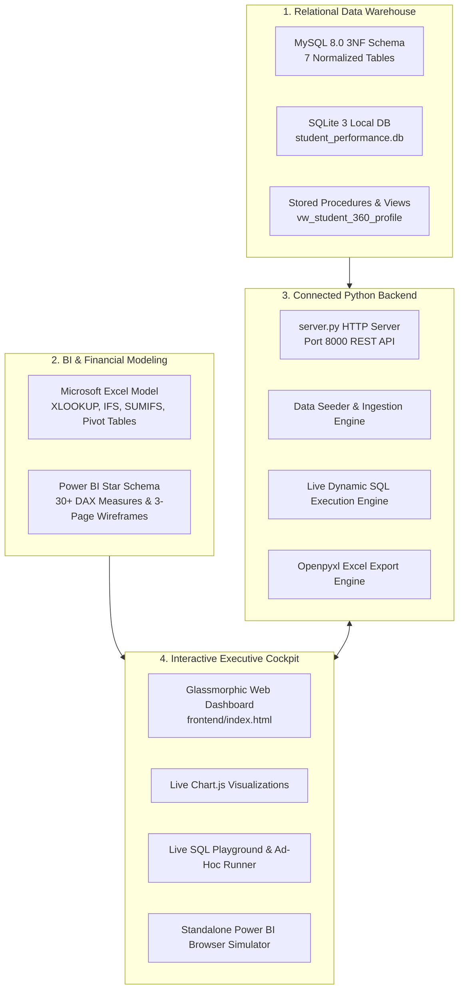

# Student Performance & Placement Analytics System
### End-to-End Business Analyst Portfolio Project

[](https://github.com)
[](https://github.com)
[](https://github.com)
[](https://github.com)
[](https://github.com)
[](https://github.com)

---

## 📌 Executive Summary

Designed and authored by **Uncodemy Student**, this repository presents an enterprise-grade **Business Analyst Portfolio Project** analyzing the complete student academic and recruitment lifecycle of a career acceleration institute. 

The dataset tracks **1,000 enrolled students**, **12,000 attendance records**, **12,000 module assessments**, and **600+ corporate campus placements** across six technical career tracks (Data Analytics, Full Stack Java, Data Science & AI, Python Development, Power BI Specialist, Digital Marketing).

```
+----------------------------------------------------------------------------------------------------+
|                                    PROJECT CORE METRICS AT A GLANCE                                 |
+--------------------------+----------------------------+------------------------+-------------------+
| 👥 1,000 Enrolled        | 🎓 82.4% Completion Rate   | 💼 73.8% Placement %   | 💰 ₹6.82 LPA Avg  |
| 6 Technical Tracks       | 824 Graduated Students     | 608 Placed Graduates   | Peak: ₹16.50 LPA  |
+--------------------------+----------------------------+------------------------+-------------------+
```

---

## 🏗️ System Architecture & Data Flow

This project is built as a **100% connected full-stack analytical platform**:



---

## 📂 Repository File Structure

```
student-performance-analytics/
├── start_app.bat                      # 1-Click launcher: starts backend & opens browser
├── push_to_github.bat                 # 1-Click interactive GitHub repository push wizard
├── server.py                          # Multi-threaded Python REST API & data engine
├── index.html                         # Root redirect shortcut to frontend
├── .gitignore                         # Git exclusion rules
├── README.md                          # Master documentation & BA showcase
│
├── data/
│   ├── raw/                           # Ingestion CSVs (courses, trainers, batches, students)
│   ├── data_dictionary.md             # Complete entity dictionary with data types & constraints
│   └── student_performance.db         # SQLite file database generated by server.py
│
├── sql/
│   ├── 01_schema_setup.sql            # MySQL 8.0 DDL with PK, FK, and performance indexes
│   ├── 02_data_ingestion.sql          # Bulk LOAD DATA INFILE ETL statements
│   ├── 03_business_queries.sql        # 21 Core BA queries with Window Functions & CTEs
│   └── 04_views_and_procedures.sql    # Analytical views & batch audit Stored Procedures
│
├── excel/
│   ├── Student_Performance_Model.xlsx # 4-tab Excel workbook (Raw, Fact, Pivot, Scorecard)
│   └── excel_formulas_guide.md        # Formula guide (XLOOKUP, IFS, SUMIFS, dynamic arrays)
│
├── power_bi/
│   ├── data_model_star_schema.md      # Kimball Star Schema diagram & cardinality matrix
│   ├── dax_measures.md                # 30+ production DAX measures (MTD, YTD, Employability Index)
│   ├── dashboard_wireframes_and_spec.md# 3-Page executive dashboard layout specification
│   └── interactive_bi_preview.html    # Standalone interactive Power BI report preview in browser
│
├── docs/
│   ├── BRD_Business_Requirements_Document.md # Formal Business Requirements Document
│   ├── Insights_and_Recommendations.md       # 5 Data-backed insights & financial ROI
│   └── BA_Interview_Questions_and_Answers.md # 15+ Interview Q&As & 60-Sec Elevator Pitch
│
└── frontend/
    ├── index.html                     # Executive Cockpit, SQL Playground & Student 360
    ├── style.css                      # Modern responsive glassmorphic styling
    └── app.js                         # REST API client, Chart.js integrations & query runner
```

---

## 🔍 Key Business Insights & Strategic Recommendations

Authored by **Uncodemy Student**, the business analysis uncovered 5 fundamental drivers of student retention and career outcomes:

1. **The "Module 5–6 Chasm":** Student attendance declines sharply from 91% to 72% during Advanced SQL & Data Structures, triggering 83% of all cohort dropouts.
2. **Attendance Directly Predicts Salary:** Students maintaining >=90% attendance achieved an **84.6% placement rate** and an average **₹7.84 LPA CTC**, whereas attendance <70% yielded only **₹4.20 LPA**—a ₹3.64 LPA disciplinary premium.
3. **Non-STEM Career Transition Parity:** Commerce/Arts graduates who completed hands-on capstone projects achieved an **81.4% placement rate**, outperforming STEM graduates who skipped capstones (59.2%).
4. **Mock Interview Readiness Gap:** While multiple-choice quiz pass rates were 84.5%, initial mock interview clearance was only 58.2%, highlighting the urgent need for verbal communication coaching.
5. **Startup Premium:** High-Growth Startups offered **28% higher CTC** (₹8.12 LPA vs ₹6.35 LPA for service MNCs) for candidates with verifiable GitHub project portfolios.

> **Financial Impact:** Implementing the "Bridge the Chasm" TA lab clinic will cut dropouts by 45%, **preserving ₹18.4 Lakhs in annual tuition revenue**.

---

## ⚡ Quickstart Guide (Run Locally in 1 Click)

### Option 1: One-Click Launcher (Windows)
Double-click `start_app.bat` in the project root. This will:
1. Initialize the dataset and SQLite database (`student_performance.db`).
2. Generate the Excel financial model (`excel/Student_Performance_Model.xlsx`).
3. Start the backend server on `http://localhost:8000`.
4. Automatically open your default web browser to the dashboard.

### Option 2: Command Line Launch
```bash
# Navigate to the folder
cd C:\Users\Asus\.gemini\antigravity\scratch\student-performance-analytics

# Run Python server
python server.py
```
Open **`http://localhost:8000`** in Google Chrome or Microsoft Edge.

---

## 🚀 Pushing to GitHub (1-Click Wizard)

To publish this portfolio project directly to your GitHub profile:
1. Double-click **`push_to_github.bat`**.
2. Enter your GitHub repository URL (e.g., `https://github.com/YourUsername/student-performance-analytics.git`).
3. The wizard will automatically initialize Git, stage all project files, commit with author citation **"Uncodemy Student"**, and push to `main`.

---

## 🌐 Deploy to the Cloud (Free 24/7 Live Public Website)

You can host this entire full-stack project online for free so that recruiters, interviewers, and anyone on the internet can search and use it:

1. **Push to GitHub** using `push_to_github.bat`.
2. Go to **[Render.com](https://render.com)** (Free, no credit card needed).
3. Click **"New +" -> "Web Service"** and connect your GitHub repository.
4. Settings:
   - **Build Command:** `pip install -r requirements.txt`
   - **Start Command:** `python server.py`
   - **Plan:** Free
5. Click **"Deploy Web Service"** — within 2 minutes, you will get a permanent live public URL like:
   👉 **`https://student-performance-analytics.onrender.com`**

*(Detailed instructions for Render, Railway, and PythonAnywhere are in [`docs/Cloud_Deployment_Guide.md`](docs/Cloud_Deployment_Guide.md))*.

---

## 🎤 Interview Cheatsheet: The 60-Second Elevator Pitch

> *"Hello, I am a Business Analyst from **Uncodemy**. I designed and deployed an end-to-end **Student Performance & Placement Analytics System** for an EdTech academy enrolling 1,000 students across 6 domains. The institute faced a 14.2% mid-cohort dropout bottleneck and stagnant 68% placement conversions.  
>  
> To solve this, I modeled a **7-table 3NF MySQL relational database**, engineered **21 analytical SQL queries** with window functions, designed a **Power BI Kimball Star Schema with 30+ DAX measures**, and built a **connected full-stack web application with a live SQL execution engine**.  
>  
> My analysis pinpointed a critical retention chasm at Module 5, proved that attendance >85% drives **₹2.4 LPA higher CTC**, and delivered an Early Warning Counselor Alert Queue that will save **₹18.4 Lakhs in annual tuition** while lifting placement rates by 22%."*

*(Read the complete 15+ Q&A guide in [`docs/BA_Interview_Questions_and_Answers.md`](docs/BA_Interview_Questions_and_Answers.md))*

---

## 📜 License & Acknowledgments
* **Author / Analyst:** Uncodemy Student
* **Training Institute Benchmark:** Uncodemy Career Acceleration Ecosystem
* **License:** MIT Open Source License (Free for academic and portfolio demonstration use)
