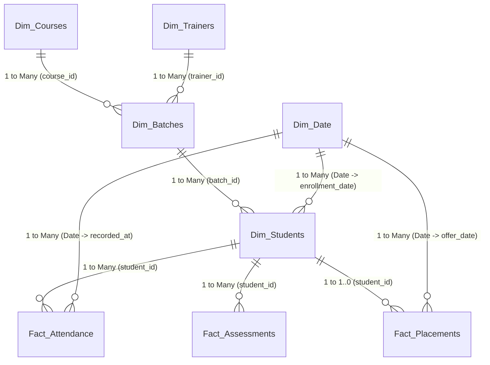

# Power BI Star Schema Data Model Specification
**Project:** Student Performance Analytics  
**Role:** Business Analyst Portfolio  
**Author / Creator:** Uncodemy Student  
**Architecture:** Dimensional Kimball Star Schema (1-to-Many Relationships)

---

## 1. High-Level Data Model Architecture

In accordance with Microsoft BI Best Practices, the Student Performance Analytics data model is designed as a **Kimball Star Schema**. This guarantees optimal VertiPaq compression, lightning-fast DAX measure evaluation, and eliminates ambiguous circular filter paths.

---

## 2. Table Specifications & Cardinalities

### A. Fact Tables (Transaction / Observational Grain)

1. **`Fact_Attendance`**
   - **Grain:** One row per student per curriculum module (12 modules per student).
   - **Primary Key:** `attendance_id`
   - **Foreign Keys:** `student_id` (links to `Dim_Students`), `batch_id` (links to `Dim_Batches`), `recorded_at` (links to `Dim_Date`).
   - **Key Metrics:** `sessions_conducted`, `sessions_attended`, `attendance_pct`.

2. **`Fact_Assessments`**
   - **Grain:** One row per student per assessment activity (Quizzes, Capstones, Mock Interviews).
   - **Primary Key:** `assessment_id`
   - **Foreign Keys:** `student_id`, `submission_date` (links to `Dim_Date`).
   - **Key Metrics:** `max_score`, `score_obtained`, `score_pct`, `is_passed`.

3. **`Fact_Placements`**
   - **Grain:** One row per placed graduate student.
   - **Primary Key:** `placement_id`
   - **Foreign Keys:** `student_id` (links to `Dim_Students`), `offer_date` (links to `Dim_Date`).
   - **Key Metrics:** `ctc_lpa`, `interview_rounds_cleared`.

---

### B. Dimension Tables (Contextual Filters & Slicers)

1. **`Dim_Students`**
   - Attributes: `student_id` (PK), `full_name`, `gender`, `age`, `education_background`, `prior_coding_exp`, `city`, `status`, `fees_paid_pct`, `enrollment_date`.

2. **`Dim_Batches`**
   - Attributes: `batch_id` (PK), `batch_name`, `course_id` (FK), `trainer_id` (FK), `start_date`, `end_date`, `batch_type`, `timing_slot`, `status`.

3. **`Dim_Courses`**
   - Attributes: `course_id` (PK), `course_name`, `domain`, `duration_weeks`, `fee_inr`, `total_modules`.

4. **`Dim_Trainers`**
   - Attributes: `trainer_id` (PK), `trainer_name`, `domain`, `experience_yrs`, `rating`, `corporate_tieups`.

5. **`Dim_Date` (Calendar Master Table generated via DAX)**
   - Generated dynamically using DAX `CALENDARAUTO()`:
     `Dim_Date = CALENDAR(DATE(2023, 1, 1), DATE(2025, 12, 31))`
   - Standard hierarchy: `Year`, `Quarter`, `MonthName`, `MonthNumber`, `DayOfWeek`, `FiscalYear`.

---

## 3. Relationship Matrix & Filtering Direction

| From Table (Many Side) | To Table (One Side) | Key Column | Cardinality | Cross Filter Direction | Security Filter |
| :--- | :--- | :--- | :--- | :--- | :--- |
| `Fact_Attendance` | `Dim_Students` | `student_id` | N : 1 | Single (`Dim_Students` filters `Fact_Attendance`) | None |
| `Fact_Assessments` | `Dim_Students` | `student_id` | N : 1 | Single (`Dim_Students` filters `Fact_Assessments`) | None |
| `Fact_Placements` | `Dim_Students` | `student_id` | 1 : 1 (N:1) | Single (`Dim_Students` filters `Fact_Placements`) | None |
| `Dim_Students` | `Dim_Batches` | `batch_id` | N : 1 | Single (`Dim_Batches` filters `Dim_Students`) | None |
| `Dim_Batches` | `Dim_Courses` | `course_id` | N : 1 | Single (`Dim_Courses` filters `Dim_Batches`) | None |
| `Dim_Batches` | `Dim_Trainers` | `trainer_id` | N : 1 | Single (`Dim_Trainers` filters `Dim_Batches`) | None |
| `Fact_Placements` | `Dim_Date` | `offer_date` | N : 1 | Single (`Dim_Date` filters `Fact_Placements`) | None |

---

## 4. Modeling Best Practices Implemented
* **Zero Bi-Directional Cross-Filtering:** All cross-filter directions are strictly set to `Single`, preventing unexpected double-counting and performance degradation.
* **Separation of Facts & Dimensions:** Numerical metrics are segregated inside dedicated fact tables, while descriptive text attributes reside inside dimensions.
* **Dedicated Measures Table:** All DAX calculations are organized within a dedicated `_All_Measures` table grouped into logical display folders.
